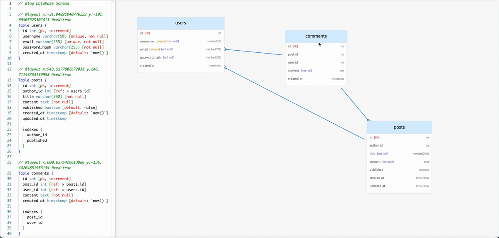
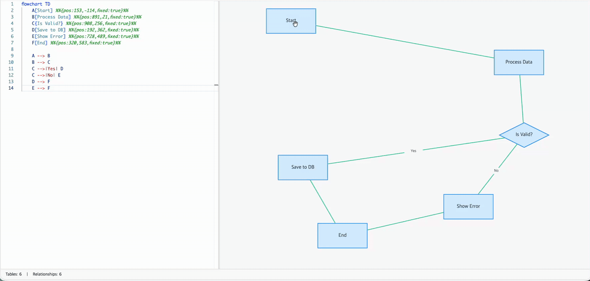

<div align="center">


# 📍 DiagramPin

> **Pin Your Diagram Layouts in Code**

Code-first diagram editor with position locking. Write DBML, Mermaid diagrams. Drag tables, pin positions in code, version control with Git.

</div>

---

## 🌐 Live Demo

**👉 [https://diagrampin.com](https://diagrampin.com)**

No signup required. Start diagramming in seconds!

---

## ✨ Key Features

- 🎨 **Multi-Language Support**: DBML & Mermaid diagrams
- 📍 **Position Locking**: Drag tables → `@layout` comments auto-update in code
- 🔄 **Bidirectional Sync**: Code ↔ Diagram real-time synchronization
- 💾 **Git Version Control**: Commit layouts alongside your schema
- 🆓 **Free to Use**: No signup, no credit card, no limits
- ⚡ **Monaco Editor**: VS Code-level editing experience
- 🎬 **Interactive Demo**: First-visit tutorial with Lottie animations

---

## 🎯 Perfect For

| User | Use Case |
|------|----------|
| **Backend Developers** | Document database schemas in Git |
| **Database Designers** | Create professional ERD diagrams |
| **Technical Writers** | Embed diagrams in documentation |
| **DevOps Teams** | Version control diagram layouts |

---

## 🔄 How It Works

### 1️⃣ Write DBML Code

```dbml
Table users {
  id bigint [pk, increment]
  email varchar(100) [unique, not null]
  name varchar(50)
  created_at timestamp [default: `now()`]
}

Table posts {
  id bigint [pk, increment]
  user_id bigint [ref: > users.id]
  title varchar(200) [not null]
}
```

### 2️⃣ See Diagram Instantly

Real-time ERD diagram with Crow's Foot notation.

### 3️⃣ Drag to Pin Position

Drag a table → `@layout` comment automatically added:

```dbml
// @layout x:350 y:150 fixed:true
Table users {
  id bigint [pk]
  email varchar(100)
}
```

### 4️⃣ Commit to Git

Your diagram layout is now version-controlled!

---

## 📸 Screenshots

### DBML Diagram Editor



*Drag tables and watch the `@layout` comments update automatically!*

### Mermaid Diagram Support



*Full Mermaid ER diagram support with position locking.*

### Open Graph Preview


---

## 🚀 Technology Stack

- **React** 18.3 + **TypeScript** 5.0
- **Vite** 5.0 (Lightning-fast builds)
- **Monaco Editor** (VS Code engine)
- **Zustand** (State management)
- **@dbml/core** (DBML parsing)
- **Mermaid** 11+ (Diagram rendering)

---

## 📚 Documentation

- **Usage Guide**: Coming soon
- **API Reference**: Coming soon
- **Layout Syntax**: `@layout x:100 y:200 fixed:true`

---

## 🐛 Found a Bug? Have a Feature Request?

We'd love to hear from you!

**👉 [Open an Issue](https://github.com/JunggiKim/diagrampin/issues/new/choose)**

Please include:
- Clear description
- Steps to reproduce (for bugs)
- Expected vs actual behavior
- Screenshots (if applicable)

---

## 💡 Feature Roadmap

- ✅ DBML support
- ✅ Mermaid ER diagrams
- ✅ Position locking with `@layout`
- ✅ Dark mode
- 🔜 PlantUML support
- 🔜 Export to PNG/SVG
- 🔜 Collaborative editing
- 🔜 Cloud sync (optional)

---

## 📞 Contact

- **Website**: [https://diagrampin.com](https://diagrampin.com)
- **Issues**: [GitHub Issues](https://github.com/JunggiKim/diagrampin/issues)
- **Feedback**: Open an issue with `[Feedback]` prefix

---

## 🙏 Acknowledgments

Built with ❤️ using:
- [DBML](https://www.dbml.org/) - Database Markup Language
- [Mermaid](https://mermaid.js.org/) - Diagram syntax
- [Monaco Editor](https://microsoft.github.io/monaco-editor/) - VS Code editor
- [React](https://reactjs.org/) - UI library
- [Vite](https://vitejs.dev/) - Build tool

---

**Made with ❤️ by the DiagramPin Team**

**Version**: 1.0.0 | **Last Updated**: 2025-11-24

---

## ⚠️ Note

This repository is for **project information and issue tracking only**.

The actual source code is maintained in a private repository.
